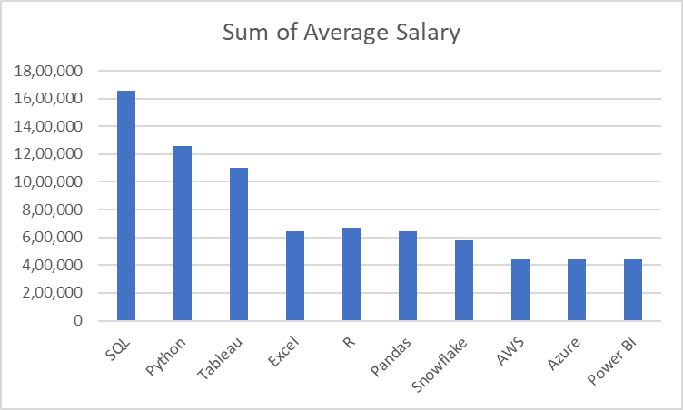

# Introduction
Dive into the data job market! Focusing on data analyst roles, this project explores top-paying jobs, in-demand skills, and where high demand meets high salary in data analytics. 

SQL queries? Check them out here: [project_sql Folder](/project_sql/) 


# Backgorund
Driven by a quest to navigate the data analyst job market more effectively, this project was born from a desire to pinpoint top-paid and in-demand skills, streamlining others’ work to find optimal jobs.

### The questions I wanted to answer through my SQL queries were:
1. What are the top-paying data analyst jobs?
2. What skills are required for these top-paying jobs?
3. What skills are most in demand for data analysts?
4. Which skills are associated with higher salaries?
5. What are the most optimal skills to learn?

# Tools I Used
For my deep dive into the data analyst job market, I harnessed the power of several key tools:

- **SQL:** The backbone of my analysis, allowing me to query the database and unearth critical insights.
- **PostgreSQL:** The chosen database management system, ideal for handling the job posting data.
- **Visual Studio Code:** My choice for database management and coding SQL queries.
- **Git & GitHub:** Essential tools for version control and sharing my SQL projects and analysis."

# The Analysis

### 1. Top Paying Data Analyst Job
To identify the highest paying roles I filtered data analyst positions by average yealry salary and location, focusing on remote jobs. This query highlights the paying opportnities in the field. 

Each query in this project aimed at investigating specific aspects of the data analyst job market.
Here's how I approached each question:

```sql
SELECT
    job_id,
    job_title,
    NAME as company_name,
    job_location,
    job_schedule_type,
    salary_year_avg,
    job_posted_date
FROM 
    job_postings_fact
LEFT JOIN company_dim ON job_postings_fact.company_id = company_dim.company_id
WHERE 
    job_title_short = 'Data Analyst' AND
    job_location = 'Anywhere' AND 
    salary_year_avg IS NOT NULL 
ORDER BY 
    salary_year_avg DESC
LIMIT 10;
```
Here’s the breakdown of the top data analyst jobs in 2023:

- ***Wide Salary Range:*** Top 10 paying data analyst roles span from $184,000 to $650,000, indicating significant salary potential in the field.
- ***Diverse Employers:*** Companies like SmartAsset, Meta, and AT&T are among those offering high salaries, showing a broad interest across different industries.
- ***Job Title Variety:*** There’s a high diversity in job titles, from Data Analyst to Director of Analytics, reflecting varied roles and specializations within data analytics.


### 2. Skills For Top Paying Job
To understand what skills are required for the top paying jobs, I joined the job postings with the skills data, providing insights into what employers value high-compensation roles.

```sql
WITH  top_paying_jobs AS (
    SELECT
        job_id,
        job_title,
        NAME as company_name,
        salary_year_avg,
        job_posted_date
    FROM 
        job_postings_fact
    LEFT JOIN company_dim ON job_postings_fact.company_id = company_dim.company_id
    WHERE 
        job_title_short = 'Data Analyst' AND
        job_location = 'Anywhere' AND 
        salary_year_avg IS NOT NULL 
    ORDER BY 
        salary_year_avg DESC
    LIMIT 10
)
SELECT
    top_paying_jobs.*,
    skills
FROM 
    top_paying_jobs
INNER JOIN skills_job_dim ON top_paying_jobs.job_id = skills_job_dim.job_id
INNER JOIN skills_dim ON skills_job_dim.skill_id = skills_dim.skill_id
ORDER BY 
    salary_year_avg;
```


### 3. In-Demand Skills For Data Analyst
This query helped identify the skills most frequently required in job postings, directing focuses to area with high demand.

```sql
SELECT
   skills,
   COUNT(skills_job_dim.job_id) AS demand_count
FROM 
   job_postings_fact
INNER JOIN skills_job_dim ON job_postings_fact.job_id = skills_job_dim.job_id
INNER JOIN skills_dim ON skills_job_dim.skill_id = skills_dim.skill_id
WHERE
   job_title_short = 'Data Analyst' AND
   job_work_from_home = TRUE
GROUP BY
   skills
ORDER BY
   demand_count DESC
LIMIT 5;
```
Here's the breakdown of the most demanded skills for data analysts in 2023:
- ***SQl*** and ***Excel*** remain fundamental, emphasizing in the need for strong foundational skills in data processing and spreadsheet manipulation. 
- ***Programming*** and ***Visualisation*** ***Tools*** like ***Python***, ***Tableau*** and ***Power Bi***  are essential, pointing towards the increasing importance for technical skills in data storytelling and decision support.

| Skills | Deman Count |
| ------------- | ------------- |
|SQL  | 7291  |
| Excel  | 4611 |
|Python  | 4330  |
| Tableau  | 3745 |
|Power Bi  | 2609  |


### 4. Skills Based On Salary
Exploring the average salary assocated with different skills revealed which skills are the highest paying.

```sql
SELECT
   skills,
   ROUND (AVG(salary_year_avg), 0)  AS avg_salary
FROM 
   job_postings_fact
INNER JOIN skills_job_dim ON job_postings_fact.job_id = skills_job_dim.job_id
INNER JOIN skills_dim ON skills_job_dim.skill_id = skills_dim.skill_id
WHERE
   job_title_short = 'Data Analyst' 
   AND salary_year_avg IS NOT NULL
   AND job_work_from_home = TRUE
GROUP BY
   skills
ORDER BY
   avg_salary DESC
LIMIT 25;
```
Here’s a breakdown of the results for top paying skills for Data Analysts:

- ***High Demand for Big Data & ML Skills***: Top salaries are commanded by analysts skilled in big data technologies (PySpark, Hadoop), machine learning tools (RapidMiner, Python libraries [Pandas, NumPy]), reflecting the industry’s high valuation of data processing and predictive modeling capabilities.
- ***Software Development & Deployment Proficiency***: Knowledge in development and deployment tools (GitLab, Kubernetes, Airflow) indicates a lucrative crossover between data analysis and engineering, with a premium on skills that facilitate automation and efficient data pipeline management.
- ***Cloud Computing Expertise***: Familiarity with cloud and data engineering tools (Elasticsearch, Databricks, GCP) underscores the growing importance of cloud-based analytics environments, suggesting that cloud proficiency significantly boosts earning potential in data analytics.

| Skills | Average Salary |
| ------------- | ------------- |
|Pyspark  | 208,172  |
| Bitbucket | 186,155 |
|Couchbase  | 160,515  |
| Watson  | 160,515 |
|Datarobot  |155,486 |
|Gitlab  | 154,500  |
| Swift  | 153,750 |
|Jupyter | 152,777  |
| Pandas | 151,821|
|Elasticsearch  | 145,000  |

### 5. Most Optimal Skills To Learn 
Combining insights from demand and salary data, this query aimed to pinpoint skills that are both high demand and have high salaries, offering a strategic focus for skill development.
```sql
WITH skills_demand AS (
    SELECT
        skills_dim.skill_id,
        skills_dim.skills,
        COUNT(skills_job_dim.job_id) AS demand_count
    FROM 
        job_postings_fact
    INNER JOIN skills_job_dim ON job_postings_fact.job_id = skills_job_dim.job_id
    INNER JOIN skills_dim ON skills_job_dim.skill_id = skills_dim.skill_id
    WHERE
        job_title_short = 'Data Analyst'
        AND salary_year_avg IS NOT NULL
        AND job_work_from_home = TRUE
    GROUP BY
        skills_dim.skill_id
), average_salary AS(
    SELECT
        skills_job_dim.skill_id,
        ROUND (AVG(job_postings_fact.salary_year_avg), 0)  AS avg_salary
    FROM 
        job_postings_fact
    INNER JOIN skills_job_dim ON job_postings_fact.job_id = skills_job_dim.job_id
    INNER JOIN skills_dim ON skills_job_dim.skill_id = skills_dim.skill_id
    WHERE
        job_title_short = 'Data Analyst' 
        AND salary_year_avg IS NOT NULL
        AND job_work_from_home = TRUE
    GROUP BY
        skills_job_dim.skill_id
)

SELECT
    skills_demand.skill_id,
    skills_demand.skills,
    demand_count,
    avg_salary
FROM
    skills_demand
INNER JOIN average_salary ON skills_demand.skill_id = average_salary.skill_id
WHERE
    demand_count > 10
ORDER BY
    avg_salary DESC,
    demand_count DESC
LIMIT 25
```
| Skill ID | Skills | Demand Count | Average salary
| ------------- | ------------- |-------- | ----- |
|8  | Go  |27  | 115,320  |
| 234 | Confluence | 11  | 114,210  |
|97  | Hadoop  |22  | 113,193  |
| 80  | Snowflake |37  | 112,948  |
|74  |Azure |34  | 111,225  |
|77  | Bigquery  |13  | 109,654  |
| 76  | Aws |32  | 108,317  |
|4 | Java  |17  | 106,906  |
| 194 | Ssis |12  | 106,683  |
|233  | Jira  |20  | 104,918  |

Here’s the breakdown of the most optimal skills for Data Analysts in 2023:

- ***High-Demand Programming Languages:*** Python and R are in high demand, with counts of 236 and 148, respectively. Despite their popularity, average salaries are around $101,397 for Python and $100,499 for R, indicating widespread proficiency.
- ***Cloud Technology Knowledge:*** Skills in specialized tools like Snowflake, Azure, AWS, and BigQuery show significant demand and offer high average salaries, emphasizing the importance of cloud platforms and big data technologies.
- ***Business Intelligence and Visualization Tools:*** Tableau and Looker are critical for data visualization and business intelligence, with counts of 230 and 49, respectively. Average salaries are around $99,288 and $103,795.
***Database Technologies:*** Demand for traditional (Oracle, SQL Server) and NoSQL databases remains strong, with average salaries ranging from $97,786 to $104,534, reflecting the ongoing need for data storage and management expertise.


# What I learned 
Throughout this adventure, I've have turbo charged my SQL toolkit wiht some serious firepower:

**Complex Query Crafting:** Mastered the art of wrangling SQL, merging tables like a pro, and avoiding common clauses for ninja-level temp table maneuvers.
**Data Aggregation:** Got cozy with GROUP BY and turned aggregate functions like COUNT() and AVG() into my data-summoning sidekicks.
**Analytical Wizardry:** Leveled up my analytical decision-making skills. Turned real-world puzzle-solving insights into queries that question into actionable, insightful SQL sorcery.


# Conclusion
### Insights 
From the analysis, several general insights emerged: 
1. **Top-Paying Data Analyst Jobs:** The highest-paying jobs for data analysts that allow remote work offer a wide range of salaries, the highest at $650,000!
2. **Skills for Top-Paying Jobs:** High-paying data analyst jobs require advanced proficiency in SQL, Python.
3. **Most In-Demand Skills:** SQL is also the most in-demand language that’s critical skill for earning top salary in data analyst job market.
4. **Skills with High Salaries:** Specialized skills like statistical analysis see major market demand still essential for top-earning jobs.
5. **Optimal Skills and Offers For High Average Salary:** In-demand IT job market values SQL leads in positions offered one of the most optimal skills for data analysts to learn to maximize earnings.
### Closing Thoughts
This project enhanced my SQL skills and provided valuable insights into the data analyst job market. The findings from the analysis serve as a guide to prioritizing skill development and better search efforts. Aspiring data analysts can position themselves in a competitive job market by focusing on high-demand, high-salary skills. This continuous learning and adaptation to emerging trends in the field of data analytics.
